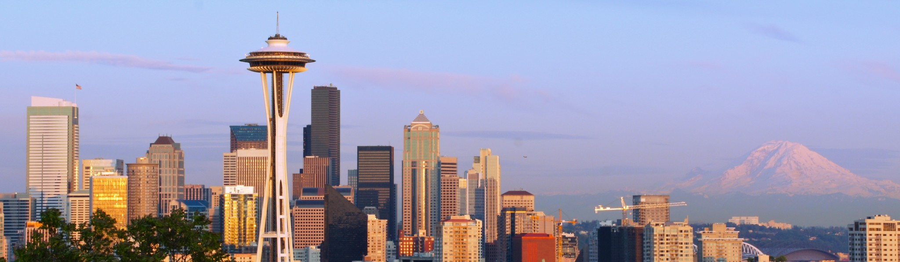
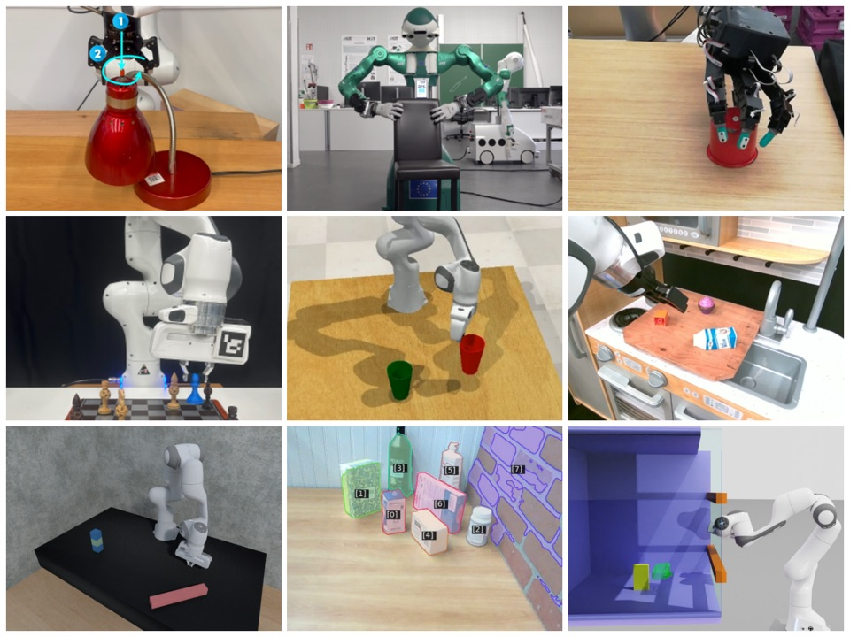
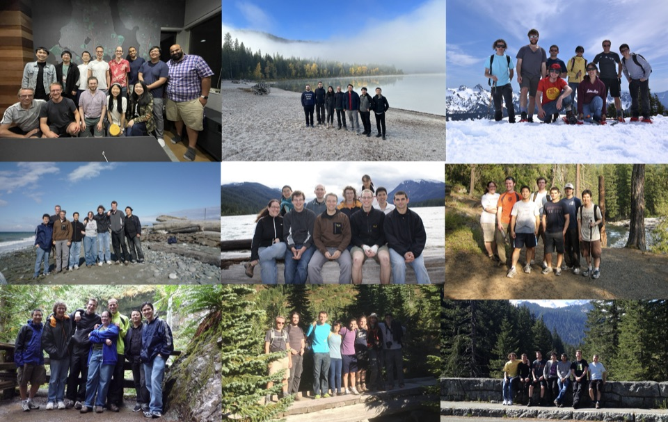

---
---

  

    
    

    

      <h1>UW Robotics and State Estimation Laboratory</h1>
      

        The RSE-Lab was established in 2001. We are interested in the development of computing systems that interact with the physical world in an intelligent way. To investigate such systems, we focus on problems in robotics and activity recognition. We develop rich yet efficient techniques for perception and control in mobile robot navigation, map building, collaboration, and manipulation. We also develop state estimation and machine learning approaches for areas such as object recognition and tracking, human robot interaction, and human activity recognition.
      

    

  

  

    <h2>Our Publications</h2>
    
  

  

    <h2>Our Team</h2>
    
  

